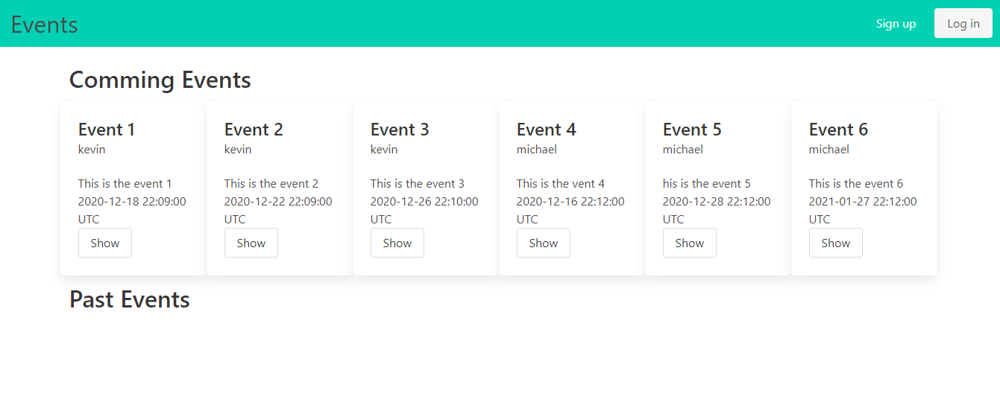

# Private events

> This project is a practice for doing association in Ruby on Rails framework

## :hammer: Built with

- Ruby
- Ruby on Rails
- Ruby gem bundler
- Ruby gem Bulma
- Linters
- VS code

## :hammer: Tested with

- Ruby gem RSpec
- Ruby gem shoulda Matchers
- Ruby gem capybara

## 📝 Pre-requisites

- Ruby v2.7.0p0
- Ruby on Rails >= 6.0.3.4

## :construction_worker: Getting Started

To get a local copy up and running follow these simple steps:

- Go to the [repository page](https://github.com/kcotrinam/Private_Events).
- Press the "Code" button and get the repo link.
- Clone it using git command `git clone <link>`.

## 📝 Setup

1. Open the terminal.
2. On the terminal navigate to the project directory using `cd Private_Events/`.
3. Install dependencies using: `bundle install`.
4. Migrate the database: `rails db:migrate`.
5. If required run: `yarn install`, and repeate the step 4.
6. Start the application : `rails server`.
7. To Stop the application : Create a user and the events.

## 📝 How to use the application?

- Start the application : `rails server`.

- Open the browser and go to : `http://localhost:3000/`

- Create a new user.

- Log-in.

- Create your new event.

## :bust_in_silhouette: Author

👤 **Kender Bolivar**

- GitHub: [@kenderb](https://github.com/ken)
- Twitter: [@twitterhandle](https://twitter.com/KBTarts )
- LinkedIn: [KenderBolivar](https://www.linkedin.com/in/kender-bolivar-1736086b/ )

👤 **Kenvin Cotrina**

- GitHub: [kcotrinam](https://github.com/kcotrinam) 
- Twitter: [@kcotrinam_dev](https://twitter.com/kcotrinam_dev)
- LinkedIn: [KevinCotrina](https://www.linkedin.com/in/kevincotrina/ )

## 🤝 :raised_hand: :raised_hand: Contributions

Contributions, issues, and feature requests are welcome!

Feel free to check the [issues page](https://github.com/kcotrinam/Private_Events/issues).

## :muscle: Show your support

Give a ⭐️ if you like this project!

## :grey_exclamation: Acknowledgment

- [Rails Guides](https://guides.rubyonrails.org/)
- [Shoulda Matchers](https://matchers.shoulda.io/docs/v4.4.1/index.html)
- Stack Overflow
- Odin Project.

 ## 📝 License

This project is [MIT](https://github.com/kcotrinam/Private_Events/blob/feature/LICENSE) licensed.
